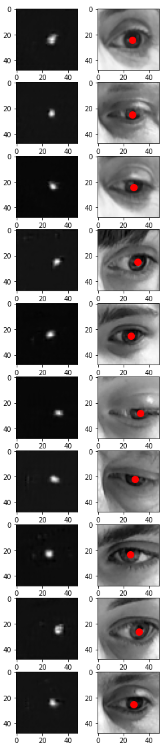

Implemented a CNN-based pupil localization pipeline in Python, reproducing the methodology from the paper "Accurate Eye Pupil Localization Using Heterogeneous CNN Models".

**Key Contributions:**
* **Model Implementation**: Reproduced a heterogeneous CNN architecture for pupil detection, adapting the paper's design to a practical Python/PyTorch workflow.
* **Data Pipeline**: Built preprocessing and augmentation routines to prepare eye image datasets for training and evaluation.
* **Evaluation**: Tracked train/test loss across training and validated predicted vs. ground-truth iris centers on held-out test images.

**Methods Used:**
* Dilation and Gaussian blurring for target (label) preprocessing
* Convolutional autoencoder as the model architecture
* Grid search across optimizers, loss functions, and activations to find the best combination:
  * optimizers: [SGD, Adam, Adamax, RMSprop]
  * loss functions: [MSE, MAE]
  * activations: [Tanh, ReLU, Sigmoid]
  * best combination found: Adam + MSE + Tanh

**Software Used:**
OpenCV, PyTorch, NumPy, Pandas, scikit-learn

**Sample Result:**

These images show the heat map and predections generated by the model.

